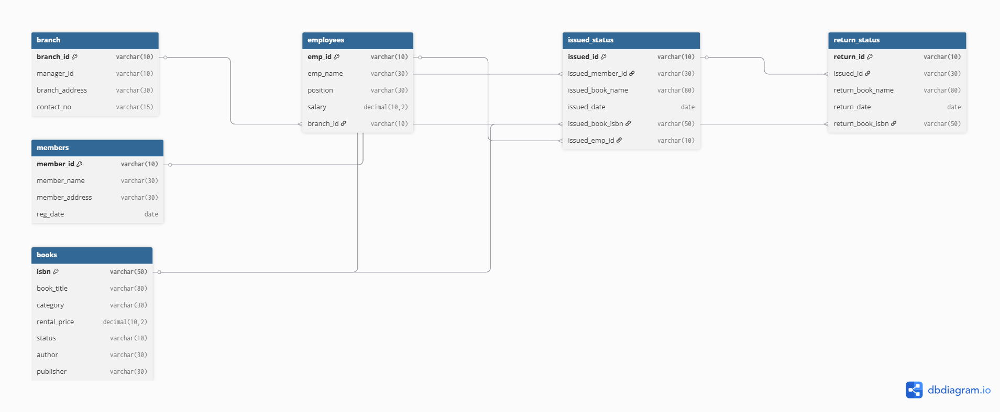

# Library Management System – SQL Database Project

## Overview
This project demonstrates the design and implementation of a **Library Management System** using SQL.  
It covers **database design**, **CRUD operations**, **advanced SQL queries**, **stored procedures**, and **analytical reporting**.  
The goal is to showcase **real-world database management skills** along with **data analysis capabilities**.

---

## Objectives
- Design and create a **normalized relational database schema**.
- Implement **CRUD operations** for library workflows.
- Write **complex SQL queries** to retrieve meaningful insights.
- Create **summary tables** using `CTAS` and **window functions** for ranking and analytics.
- Develop a **stored procedure** to manage book issuance and availability.
- Generate **branch performance** and **overdue books** reports.
- (Optional) Build **interactive dashboards** in **Power BI/Tableau**.

---

## Technologies Used
- **SQL** – Database creation, manipulation & querying  
- **MySQL** – Database engine  
- **Power BI / Tableau** – Data visualization (optional enhancement)  
- **Draw.io / Lucidchart** – ERD diagram design  

## Database Schema
**Entities:**
- **Branch** – Library branch details  
- **Employees** – Staff details & branch assignments  
- **Members** – Registered library members  
- **Books** – Catalog with pricing & availability  
- **Issued_Status** – Book issuance records  
- **Return_Status** – Book return records  

## Project Structure

# library-management-system-sql
SQL Project: Library Management System
>>>>>>> 12b5d84409db47f95674492b45665caa15baaea4
